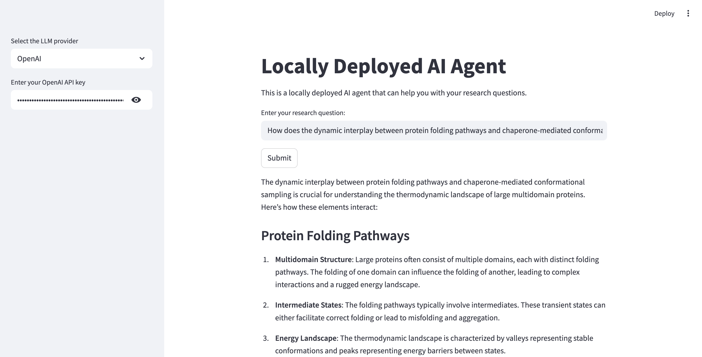
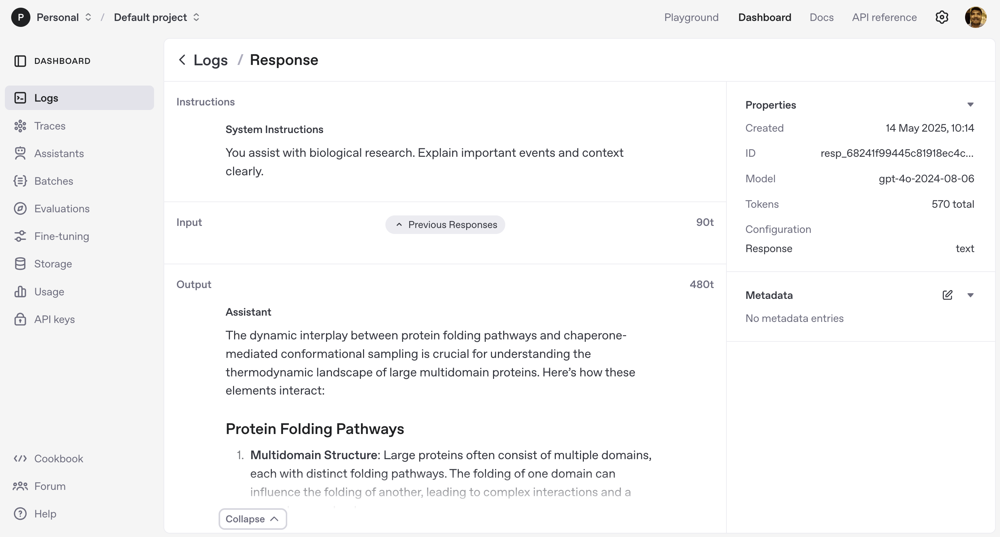
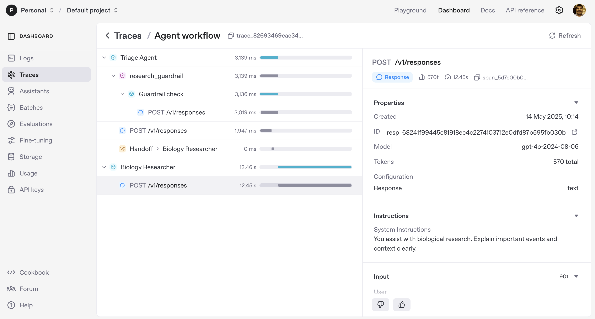

# 🚀 **Locally Deployed AI Agent using OpenAI Agents SDK, Streamlit & Docker**

This guide walks you through creating, containerizing, and running a **locally deployed AI research assistant** powered by **Streamlit** and **OpenAI Agents**.  
It includes agent orchestration, guardrails, and a triage mechanism for domain-specific responses.

---

## 🧩 Step 1: Add the following code in `app.py`

```python
# ---------------------------------------------
# IMPORTS AND INITIAL SETUP
# ---------------------------------------------
import nest_asyncio
nest_asyncio.apply()  # Enables async event loops to run inside Streamlit

# Import agent framework and utilities
from agents import Agent, InputGuardrail, GuardrailFunctionOutput, Runner
from pydantic import BaseModel
import streamlit as st
import asyncio
import time
import os

# ---------------------------------------------
# STREAMLIT UI CONFIGURATION
# ---------------------------------------------
st.title("Locally Deployed AI Agent")
st.write("This is a locally deployed AI agent that can help you with your research questions.")

# Sidebar for LLM selection and API key input
add_selectbox = st.sidebar.selectbox(
    "Select the LLM provider",  # Extend to include other models later (Gemini, Claude, etc.)
    (["OpenAI"])
)

openai_key = st.sidebar.text_input("Enter your OpenAI API key", type="password")
os.environ["OPENAI_API_KEY"] = openai_key

# ---------------------------------------------
# DEFINE MODEL FOR OUTPUT VALIDATION
# ---------------------------------------------
class ResearchOutput(BaseModel):
    is_research: bool    # True if the question is research-related
    reasoning: str       # Explanation or rationale behind classification

# ---------------------------------------------
# GUARDRAIL AGENT (VALIDATION)
# ---------------------------------------------
guardrail_agent = Agent(
    name="Guardrail check",
    instructions="Check if the user is asking about research.",
    output_type=ResearchOutput,  # Ensures structured validation output
)

# ---------------------------------------------
# DOMAIN-SPECIFIC AGENTS
# ---------------------------------------------
cs_research_agent = Agent(
    name="CS Researcher",
    handoff_description="Specialist agent for Computer Science Research",
    instructions="You provide help with CS research. Explain your reasoning at each step and include examples.",
)

bio_research_agent = Agent(
    name="Biology Researcher",
    handoff_description="Specialist agent for Biological Research",
    instructions="You assist with biological research. Explain important events and context clearly.",
)

# ---------------------------------------------
# GUARDRAIL FUNCTION IMPLEMENTATION
# ---------------------------------------------
async def research_guardrail(ctx, agent, input_data):
    """
    This function ensures the user's input is research-related.
    If not, it triggers the guardrail and blocks processing.
    """
    result = await Runner.run(guardrail_agent, input_data, context=ctx.context)
    final_output = result.final_output_as(ResearchOutput)
    return GuardrailFunctionOutput(
        output_info=final_output,
        tripwire_triggered=not final_output.is_research,  # Block non-research inputs
    )

# ---------------------------------------------
# TRIAGE AGENT (DECISION ROUTER)
# ---------------------------------------------
triage_agent = Agent(
    name="Triage Agent",
    instructions="You determine which agent to use based on the user's research question.",
    handoffs=[cs_research_agent, bio_research_agent],  # Possible next agents
    input_guardrails=[InputGuardrail(guardrail_function=research_guardrail)],  # Validation layer
)

# ---------------------------------------------
# TRACING SETUP (OPTIONAL)
# ---------------------------------------------
from agents.tracing.setup import GLOBAL_TRACE_PROVIDER
from agents import set_tracing_export_api_key

set_tracing_export_api_key(os.getenv("OPENAI_API_KEY"))
GLOBAL_TRACE_PROVIDER._multi_processor.force_flush()  # Ensures traces are exported

# ---------------------------------------------
# STREAMLIT MAIN APP
# ---------------------------------------------
async def main():
    user_input = st.text_input("Enter your research question:")
    
    if st.button("Submit"):  # Runs on button click
        with st.spinner("Processing..."):
            time.sleep(10)  # Simulate latency for user feedback
        result = await Runner.run(triage_agent, user_input)
        st.write(result.final_output)

# Entry point
if __name__ == "__main__":
    asyncio.run(main())
```

---

## 🐳 Step 2: Create a `Dockerfile`

```dockerfile
# ---------------------------------------------
# BASE IMAGE
# ---------------------------------------------
FROM python:3.11.12-slim-bullseye

# ---------------------------------------------
# ENVIRONMENT CONFIGURATION
# ---------------------------------------------
ENV HOST=0.0.0.0
ENV LISTEN_PORT=8080
EXPOSE 8080

# ---------------------------------------------
# WORKING DIRECTORY
# ---------------------------------------------
WORKDIR /app
COPY . /app

# ---------------------------------------------
# INSTALL DEPENDENCIES
# ---------------------------------------------
RUN pip install --no-cache-dir pydantic-ai openai-agents nest-asyncio streamlit

# ---------------------------------------------
# RUN STREAMLIT APP
# ---------------------------------------------
CMD ["streamlit", "run", "app.py", "--server.port", "8080"]
```

---

## 🛠️ Step 3: Build, Tag, and Push the Docker Image

```bash
# Build the Docker image
docker build -t loc-agent-docker-app .

# Tag it for DockerHub
docker tag loc-agent-docker-app sachin004/loc-agent-docker-app:v1

# Push to your DockerHub repository
docker push sachin004/loc-agent-docker-app:v1
```

> 💡 **Instructor Tip:**  
> Ensure you’ve logged into DockerHub before pushing:  
> ```bash
> docker login
> ```

---

## 🧪 Step 4: Run the Docker Container

```bash
# Run container locally and map port 8080
docker run -p 8080:8080 loc-agent-docker-app
```

Visit **http://localhost:8080** in your browser to view your Streamlit-based agent interface.

---

## 🚀 Output Screenshots

### 🖥️ **Streamlit Interface**


### 📊 **Logs and Traces**
  


---

## ✅ Summary

| Step | Task | Concept Learned |
|------|------|----------------|
| 🧩 1 | Implement `app.py` | Multi-agent orchestration & guardrails |
| 🐳 2 | Create Dockerfile | Containerization workflow |
| 🚀 3 | Push Image | DockerHub deployment |
| 🔍 4 | Run Locally | Local deployment testing |

---

## 🧭 Next Steps

- 🔬 Extend agents to other domains (Physics, Literature, etc.).  
- 🧩 Integrate **LangSmith** or **LlamaIndex** for monitoring and data augmentation.  
- ☁️ Deploy using **AWS ECS**, **Google Cloud Run**, or **Azure App Service**.  
- 🧠 Explore **CrewAI**, **Autogen**, or **LangGraph** for multi-agent collaboration.  

---


