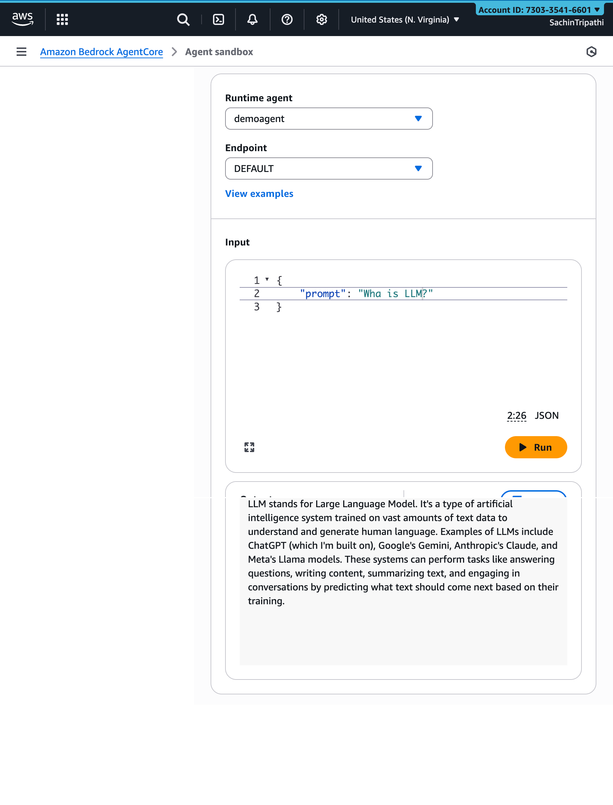

# 🤖 Strands with AWS Bedrock and AgentCore — Complete Setup Guide

This guide helps you **set up, build, and deploy** your first AI Agent using **Strands**, **AWS Bedrock**, and **AgentCore**.  
It combines local setup steps, Codespaces configuration, and full deployment to the **Bedrock AgentCore Runtime**.

---

## 🧰 Prerequisites

Before starting, ensure you have:

- ✅ An **AWS account** with valid credentials.
- 🐍 **Python 3.10+** installed.
- 🔧 **boto3** installed (`pip install boto3`).
- 🧾 **Amazon Bedrock access** with permission for at least one model (e.g., *Claude Sonnet 4.0*).
- ⚙️ **AWS CLI** configured locally (`aws configure`).
- 💻 A **GitHub Codespaces** or local environment ready.

---

# 🧱 Part 1 — Setup GitHub Repository and AWS IAM Access

## Step 1 — Create a New Repository on GitHub

1. Go to your GitHub profile → **New Repository**.  
2. Name it `agentcore`.  
3. Set visibility to **Private** and check **Add README**.  
4. Click **Create Repository**.

<p align="center">
  
  <br/>
</p>

---

## Step 2 — Open Repository in Codespaces

1. Click **Code → Codespaces → Create codespace on main**.

<p align="center">
  
  <br/>
</p>

---

## Step 3 — Create `.gitignore` & `.env` files

```bash
touch .gitignore .env
```

<p align="center">
  
  <br/>
</p>

---

## Step 4 — Update `.gitignore` File with the following filelist

```
.env
.bedrock_agentcore.yaml
```

<p align="center">
  
  <br/>
</p>

---

## Step 5 — Configure AWS Credentials in .`env` file

```
AWS_ACCESS_KEY_ID=
AWS_SECRET_ACCESS_KEY=
AWS_DEFAULT_REGION=
```
<p align="center">
  
  <br/>
</p>

---

## Step 6 — Create an IAM User

Navigate to **IAM → Users → Create User**.

<p align="center">
  
  <br/>
</p>

---

## Step 7 — Assign IAM Permissions

Choose **Attach policies directly → AdministratorAccess**.

<p align="center">
  
  <br/>
</p>

---

## Step 8 — Review and Create IAM User

Confirm and click **Create User**.

<p align="center">
  
  <br/>
</p>

---

## Step 9 — Generate Access Keys

Select **Command Line Interface (CLI)** → click **Next**.

<p align="center">
  
  <br/>
</p>

---

## Step 10 — Retrieve Access Keys

Copy or download credentials and update `.env`.

<p align="center">
  
  <br/>
</p>

---

# ⚙️ Part 2 — Build and Deploy Your First AgentCore AI Agent

## Step 11 — Create Agent Folder and Script

```bash
mkdir docker
cd docker
touch agentcore.py
```

<p align="center">
  
  <br/>
</p>

---

## Step 12 — Add Requirements

```bash
touch requirements.txt
```

```
strands-agents
bedrock-agentcore
```

<p align="center">
  
  <br/>
</p>

---

## Step 13 — Write the AgentCore Python Script

```python
from dotenv import load_dotenv
from strands import Agent
from bedrock_agentcore.runtime import BedrockAgentCoreApp

load_dotenv()

agent = Agent("us.anthropic.claude-3-7-sonnet-20250219-v1:0")
app = BedrockAgentCoreApp()

@app.entrypoint
def invoke_agent(payload, context):
    prompt = payload.get("prompt")
    return {"result": agent(prompt).message}

app.run()
```

<p align="center">
  
  <br/>
</p>

---

## Step 14 — Install Dependencies

```bash
pip install -r strands-agents python-dotenv bedrock-agentcore
```

<p align="center">
  
  <br/>
</p>

---

## Step 15 — Run the Agent Locally

```bash
python agentcore.py
```

<p align="center">
  
  <br/>
</p>

---

## Step 16 — Verify Port Forwarding

Ensure **port 8080** is active and auto-forwarded.

<p align="center">
  
  <br/>
</p>

---

## Step 17 — Configure Bedrock AgentCore

```bash
export $(cat /workspaces/agentcore/.env | grep -v ^# | xargs)


pip install bedrock-agentcore-starter-toolkit


agentcore configure --entrypoint agentcore.py --name demoagent
```

Follow prompts to auto-create IAM role, ECR repo, and short-term memory.

<p align="center">
  
  <br/>
</p>

---

## Step 18 — Confirm Configuration Summary

You’ll see:

```
Agent Name: demoagent
Deployment: container
Region: us-east-1
Execution Role: Auto-create
ECR Repository: Auto-create
Memory: Short-term (30-day retention)
```

<p align="center">
  
  <br/>
</p>

---

## Step 19 — Launch Your Agent

```bash
agentcore launch
```

<p align="center">
  
  <br/>
</p>

---

## Step 20 — Deployment Success

**Key Outputs:**  
- Agent ARN  
- ECR URI  
- CloudWatch Log Group  
- GenAI Observability Dashboard URL

Use:
```bash
agentcore status
agentcore invoke '{"prompt": "What is LLM?"}'
```

---

## Step 21 — Test the Agent in AWS Agent Sandbox

Example input:
```json
{ "prompt": "What is LLM?" }
```

**Output:**
> “LLM stands for Large Language Model. It’s a type of artificial intelligence system trained on vast amounts of text data to understand and generate human language...”

<p align="center">
  
  <br/>
</p>

---

## Step 22 — Destroy AgentCore Resources

```
agentcore destroy
```
<p align="center">
  
  <br/>
</p>

--- 

# 🧩 Summary

You have successfully:

✅ Created and configured a **Strands-powered Agent**  
✅ Deployed it to **AWS Bedrock AgentCore** Runtime  
✅ Verified runtime behavior using **Agent Sandbox**  
✅ Integrated short-term memory, IAM, and observability

---

# 🌟 Next Steps

- Integrate multi-agent orchestration using **LangGraph** or **CrewAI**.  
- Add **custom tool plugins** or API connectors.  
- Build a frontend interface using **FastAPI** or **Streamlit**.  
- Enable **CloudWatch Metrics** and Observability Dashboard for runtime monitoring.

---
